```{r options, include=FALSE}
knitr::opts_chunk$set(echo = FALSE, message = FALSE, warning = FALSE)
```

# Catskills Fire Tower Challenge 

### November 4-6, 2022

<div align = "center">

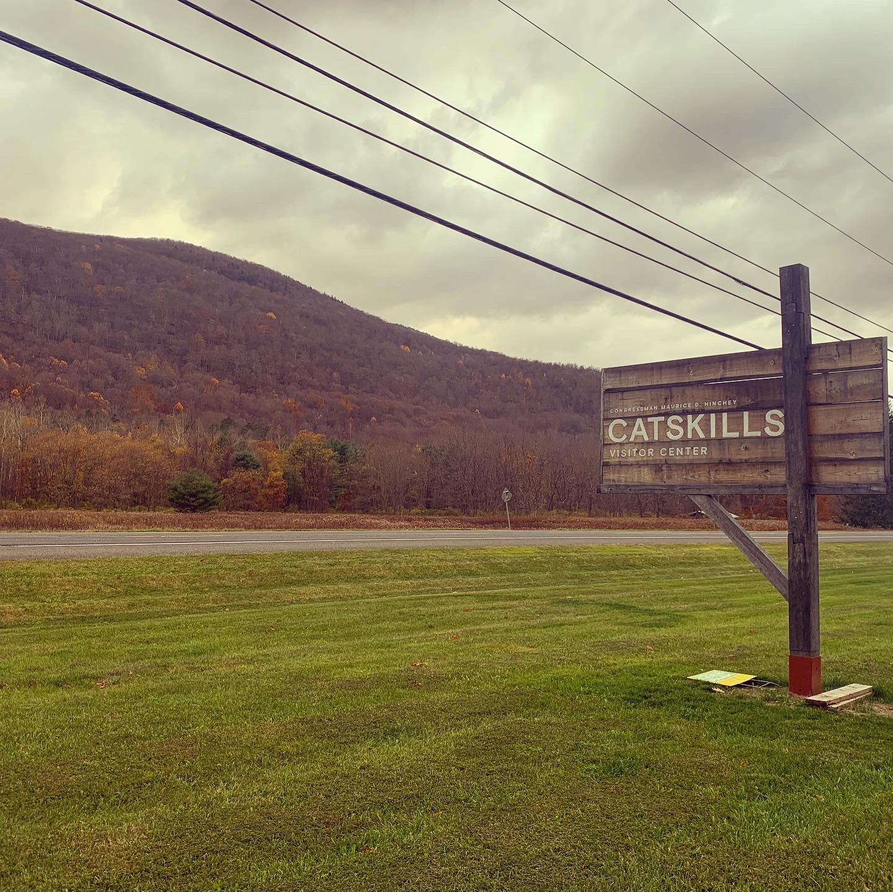

</div>

<br> 

### The Challenge 

For nearly a century, observers watched the forests of New York State--including the Catskill and Adirondack forest preserves-- from more than 100 fire towers perched atop the highest peaks, searching for the dangerous, telltale signs of forest fires. The [Catskills Fire Tower Challenge](https://www.dec.ny.gov/lands/76620.html) encourages experienced hikers to visit the region's remaining five historic fire towers, as well as a new sixth fire tower that was opened at the Catskills Visitor Center in the fall of 2019.

<div align = "center">

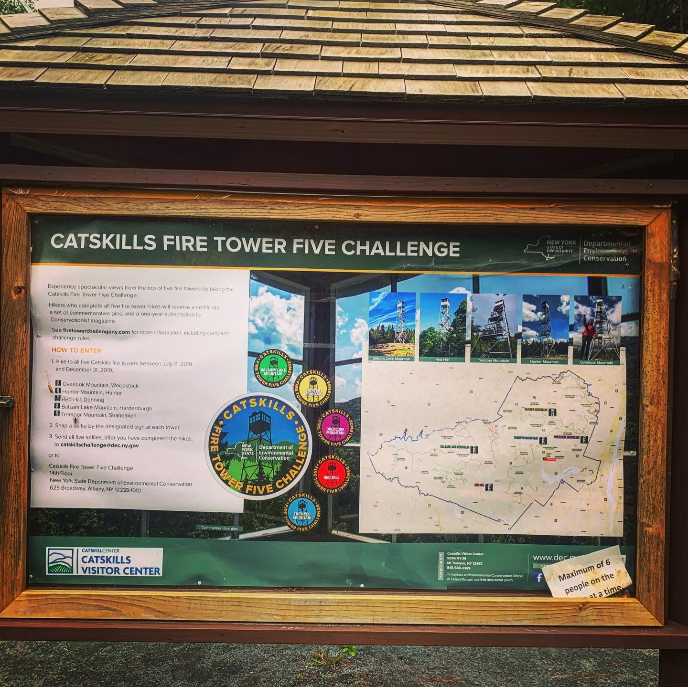

</div>

To enter, visit all six Catskill Fire Towers between January 1, 2022 and December 31, 202 and fill out the log of completed hikes along with one favorite photo.

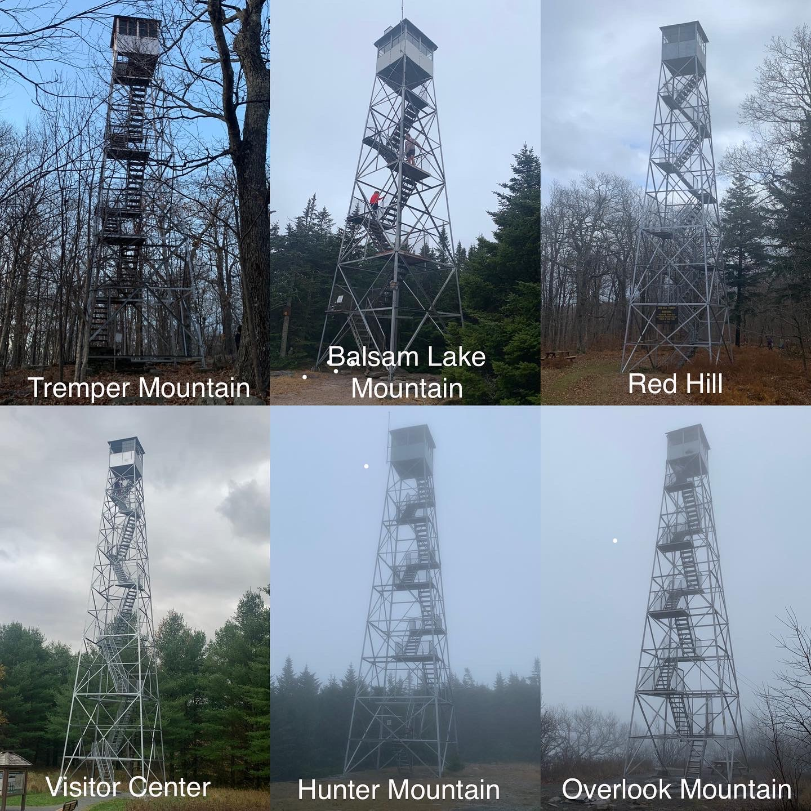

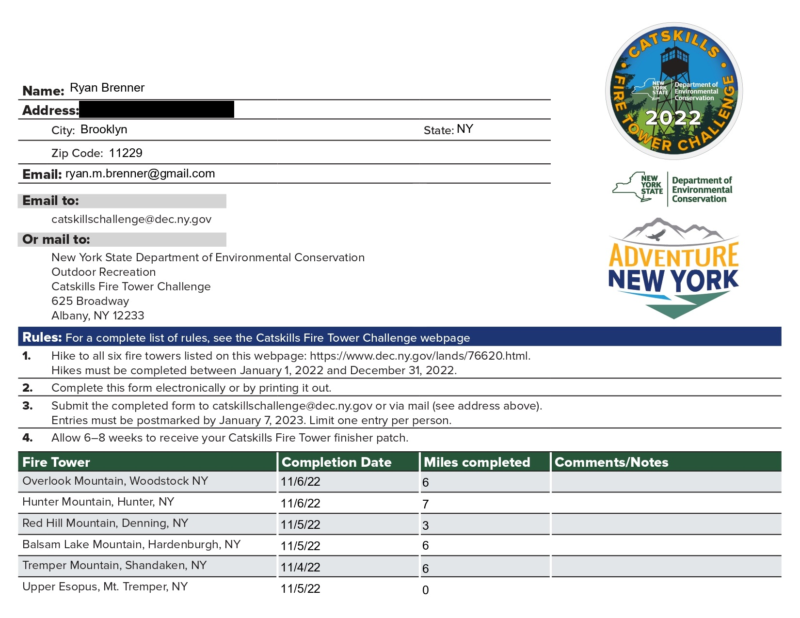

<div align="center">

<iframe width="560" height="315" src="https://www.youtube.com/embed/e2I58eNRgeU" data-external="1" title="YouTube video player" frameborder="0" allow="accelerometer; autoplay; clipboard-write; encrypted-media; gyroscope; picture-in-picture" allowfullscreen></iframe>

</div>

<br> 

### What Are Fire Towers?

<div align="center">

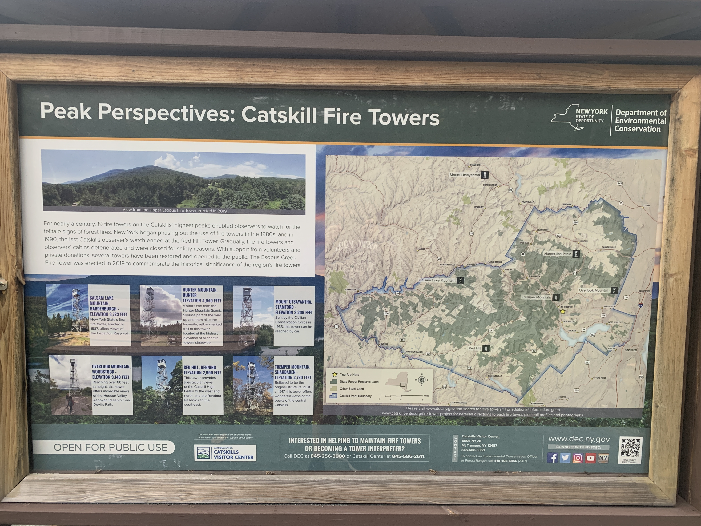

</div>

<br> 

For nearly a century, observers watched the forests of New York State from more than 100 fire towers perched atop the highest peaks, searching for the dangerous, telltale signs of forest fires. There were 19 fire towers in the Catskill region and 52 in the Adirondacks.

Beginning in the 1980s, the State of New York began to phase out the use of fire towers for spotting forest fires, and in 1990, the last 5 towers still in operation were closed. Over time, the towers and their associated observers' cabins began to deteriorate, and those that were not dismantled were closed to the public for safety reasons.

Across the state grassroots, volunteer-based initiatives were formed to try to save the towers. These initiatives recognized that the towers not only represent a piece of the history and heritage of New York State forest protection, but are an untapped resource with tremendous tourism potential. Through the dedication of countless volunteers, as well as assistance and support from DEC staff, local government and the State Police Aviation Unit, many fire towers across the state have been restored.

([DEC Fire Towers](https://www.dec.ny.gov/outdoor/100900.html))

<br> 

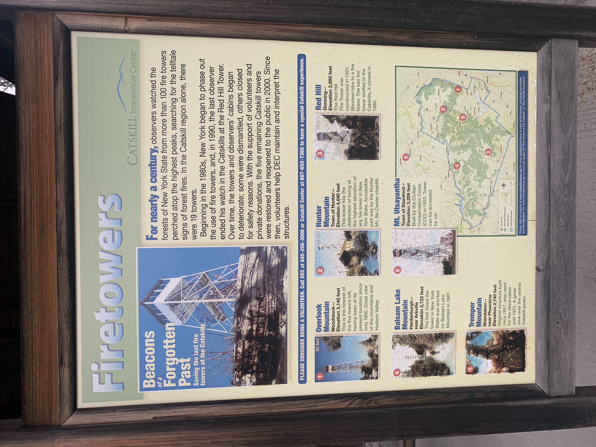

</div>

<br> 

### The Towers

```{r, out.width = "1000px"}
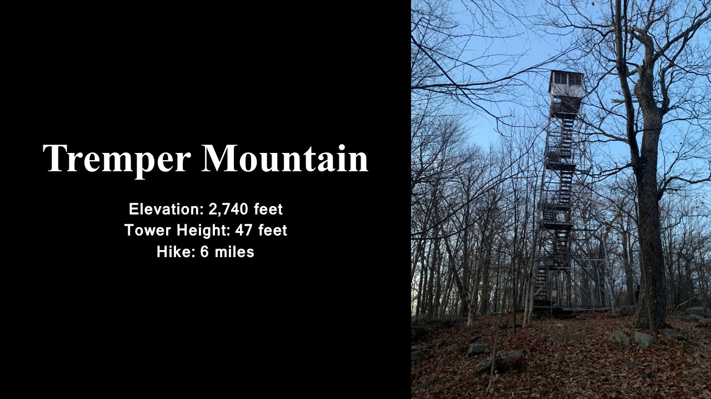
```

The Mount Tremper Fire Observation Station is an historic fire observation station located on Mount Tremper at Shandaken in Ulster County, New York. The station and contributing resources include a 47-foot-tall (14.3 m), steel frame lookout tower erected in 1917 and a jeep trail that extends from the base of the mountain to a point below its summit. The tower is a prefabricated structure built by the Aermotor Corporation to provide a front line of defense in preserving the Catskill Park from the hazards of forest fires. (Wikipedia)

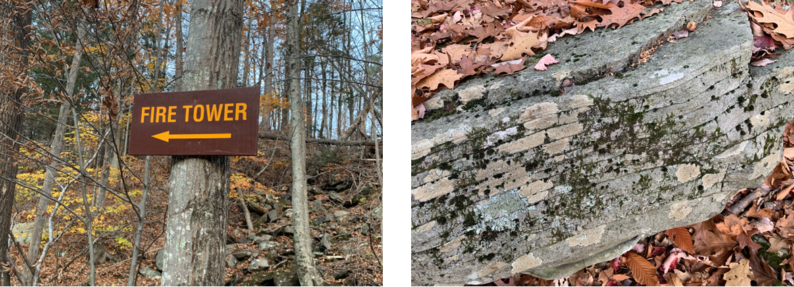

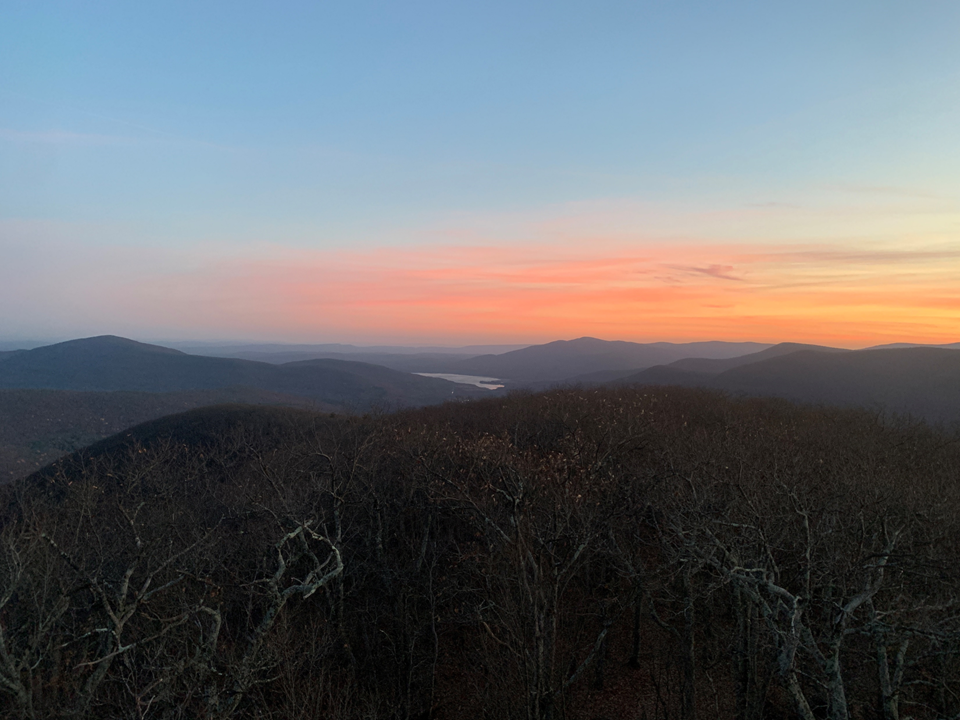

<br>

```{r, out.width = "1000px"}
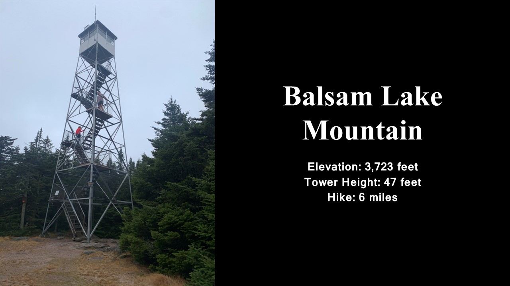
```

The Balsam Lake Mountain Fire Observation Station is located at the summit of the mountain of that name in the Town of Hardenburgh, New York. It comprises a steel frame fire lookout tower, the observer's cabin and privy, and the jeep road to the complex. Balsam Lake Mountain, the westernmost of the Catskill High Peaks, was the site of the first fire lookout tower in New York in 1887, when a nearby sportsmen's club built it to protect their lands below the mountain. It was later taken over by the state, which built several towers culminating in the current one. The tower was staffed until 1988. (Wikipedia)

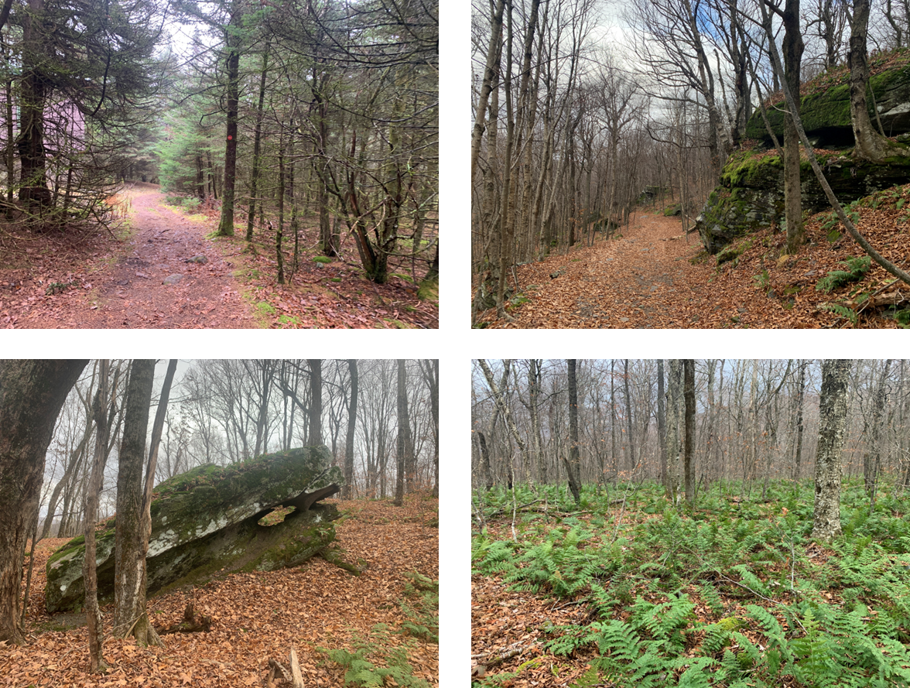

<br>

```{r, out.width = "1000px"}
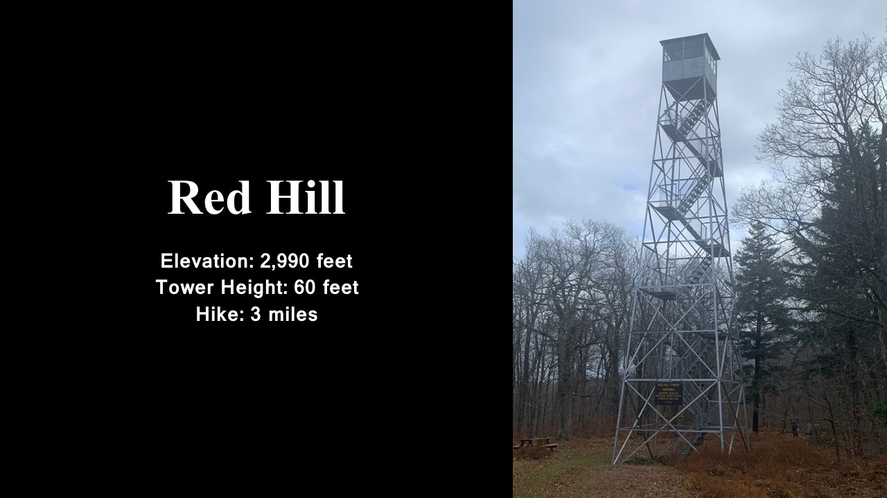
```

The Red Hill Fire Observation Station consists of a fire lookout tower, cabin, and pit privy located on the summit of Red Hill, a 2,990-foot (910 m) Catskill Mountain peak in Denning, New York. It is the southernmost fire tower in the Catskill Park. One of the last state towers built, in 1920, it filled a missing link in the Catskills' forest fire detection network. Except for a few brief periods of closure, observers working for the state conservation agencies staffed the tower through 1990, making it the last fire tower closed in the Catskills. (Wikipedia)

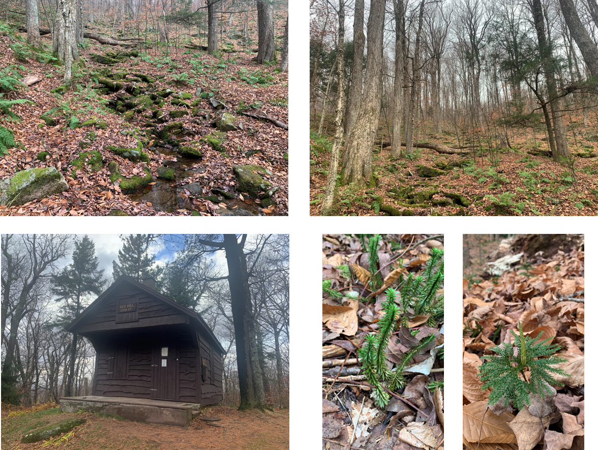

<br>

```{r, out.width = "1000px"}
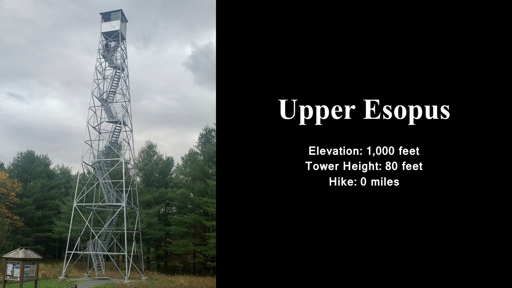
```

The Upper Esopus Fire Tower is located at the Catskill Visitor Center in Mount Tremper, Ulster County. Relocated from Venice, Florida and opened in 2019, the fire tower offers an introductory fire tower experience to visitors to the Catskills, providing an unencumbered view of the Upper Esopus Valley and surrounding Catskill Mountains. In addition, the fire tower allows visitors who may not otherwise be able to undertake the challenging hike of several miles to experience a fire tower on the high peaks in the Catskills. (DEC)

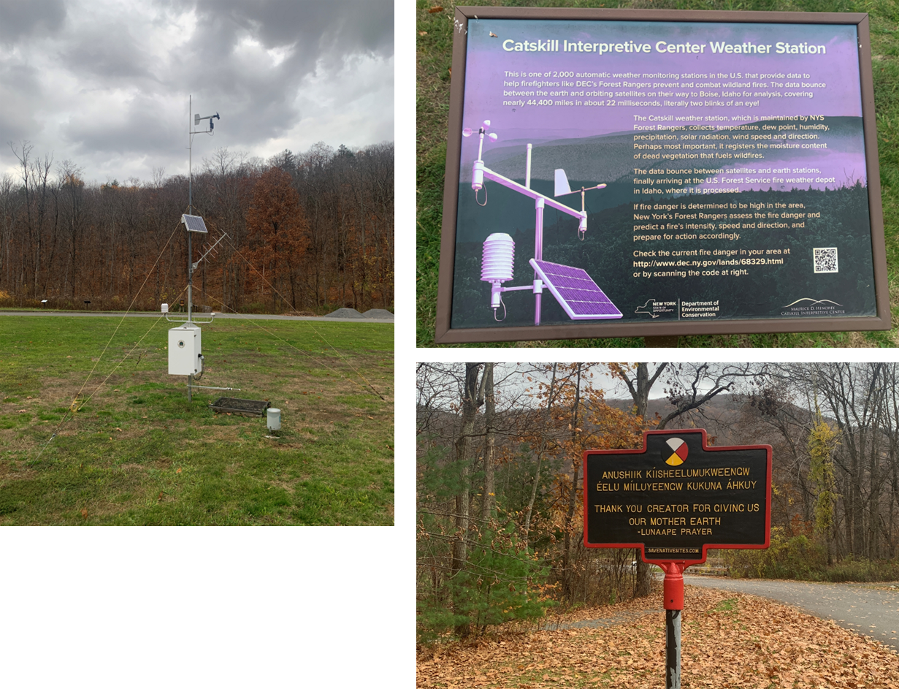

<br>

```{r, out.width = "1000px"}
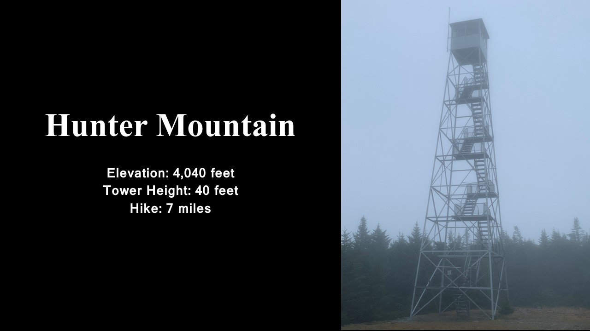
```

The Hunter Mountain Fire Tower is located on the summit of the eponymous mountain, second highest of the Catskill Mountains in New York. It was the first of 23 fire lookout towers built by the state in the region, and the next-to-last of the five still standing to be abandoned. Panoramic views of not only the mountains but the adjacent Hudson Valley, Massachusetts, Connecticut, and sometimes southwestern Vermont are available from it. Likewise, it can be seen from many of the surrounding mountains, the village of Hunter, and the upper slopes of the ski area. It is the highest fire tower still standing in the state and the second-highest in the entire Northeast. (Wikipedia)

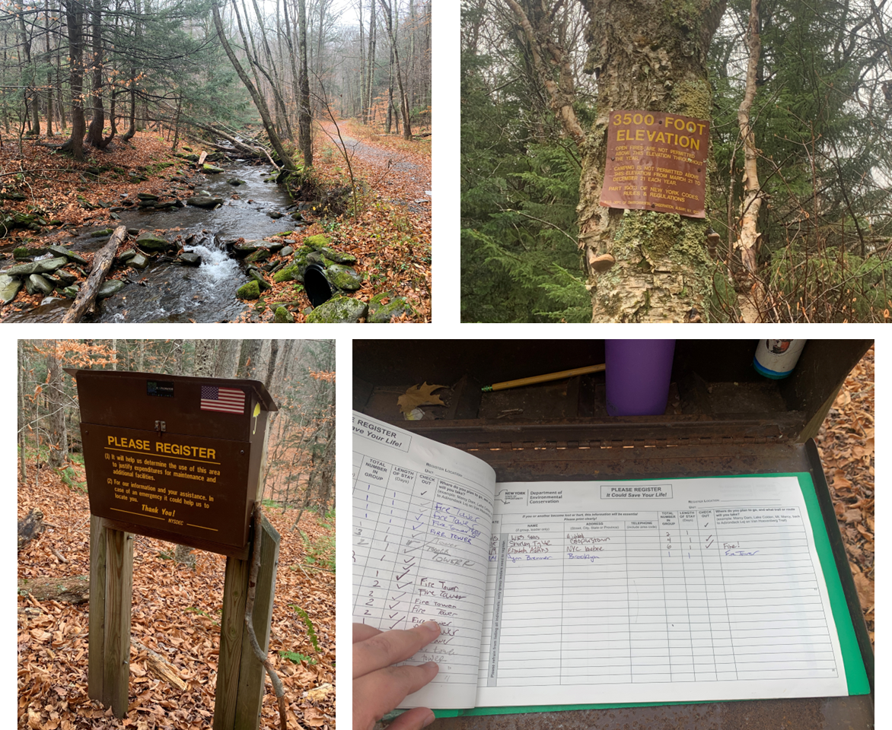

<br>

```{r, out.width = "1000px"}
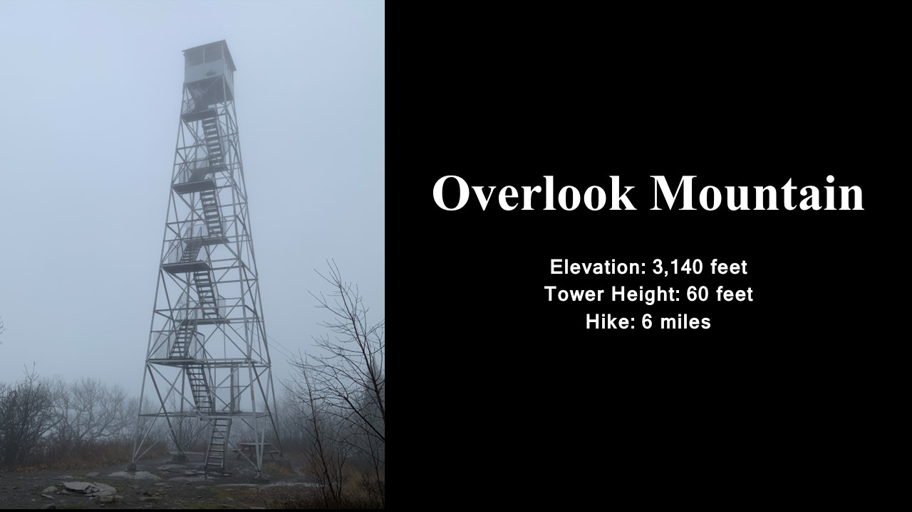
```

The Overlook fire tower was originally constructed in 1927 on Gallis Hill, west of Kingston, New York, and was moved to its present location in 1950. The 60-foot (18.3 m) tower was used by fire stewards to more easily locate wildfires. The tower, along with the others in the Catskills, were closed for safety reasons in 1988. Overlook's tower was the first to reopen after renovations were completed, on June 5, 1999. (Wikipedia)

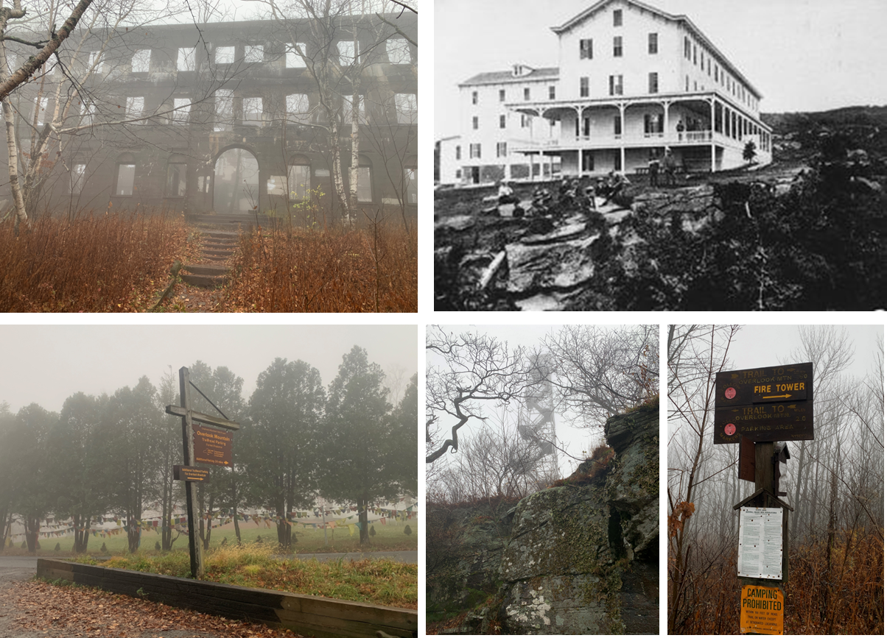

<br> 

### More on the Catskills! 

<div align="center">

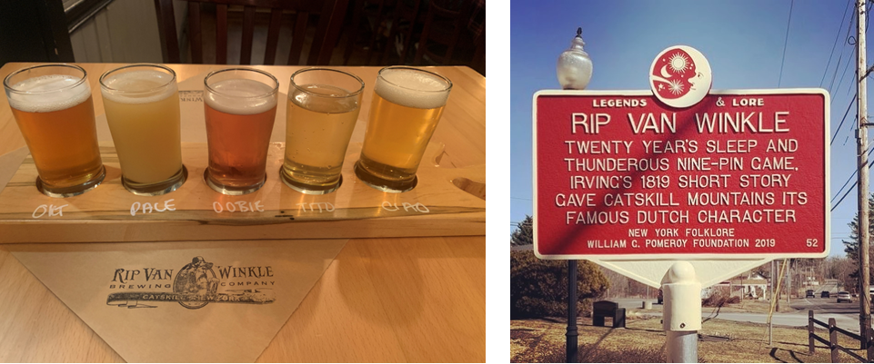

<br>

<iframe width="560" height="315" src="https://www.youtube.com/embed/YIlBlBGaqvU" data-external="1" title="YouTube video player" frameborder="0" allow="accelerometer; autoplay; clipboard-write; encrypted-media; gyroscope; picture-in-picture" allowfullscreen></iframe>

<br>


<br>

```{r, out.width = "400px"}

```

**Thanks for checking out my adventure!**

</div>

<br> 